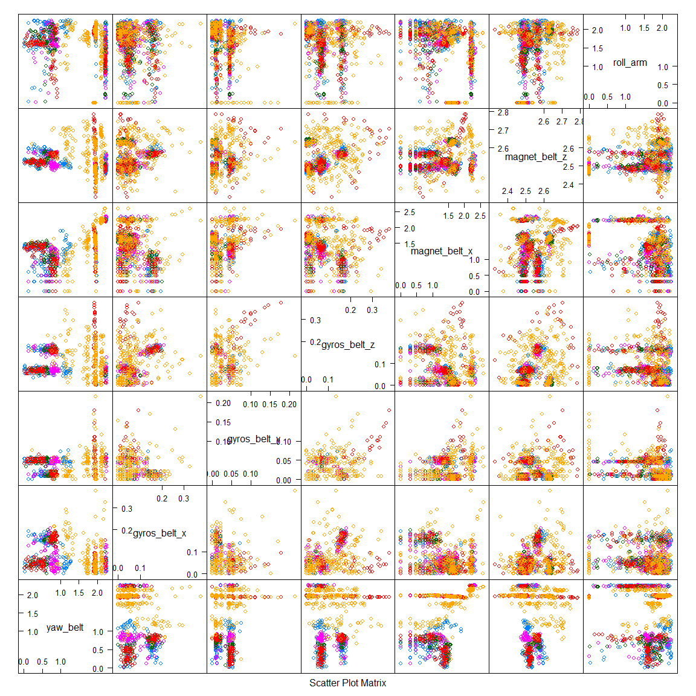
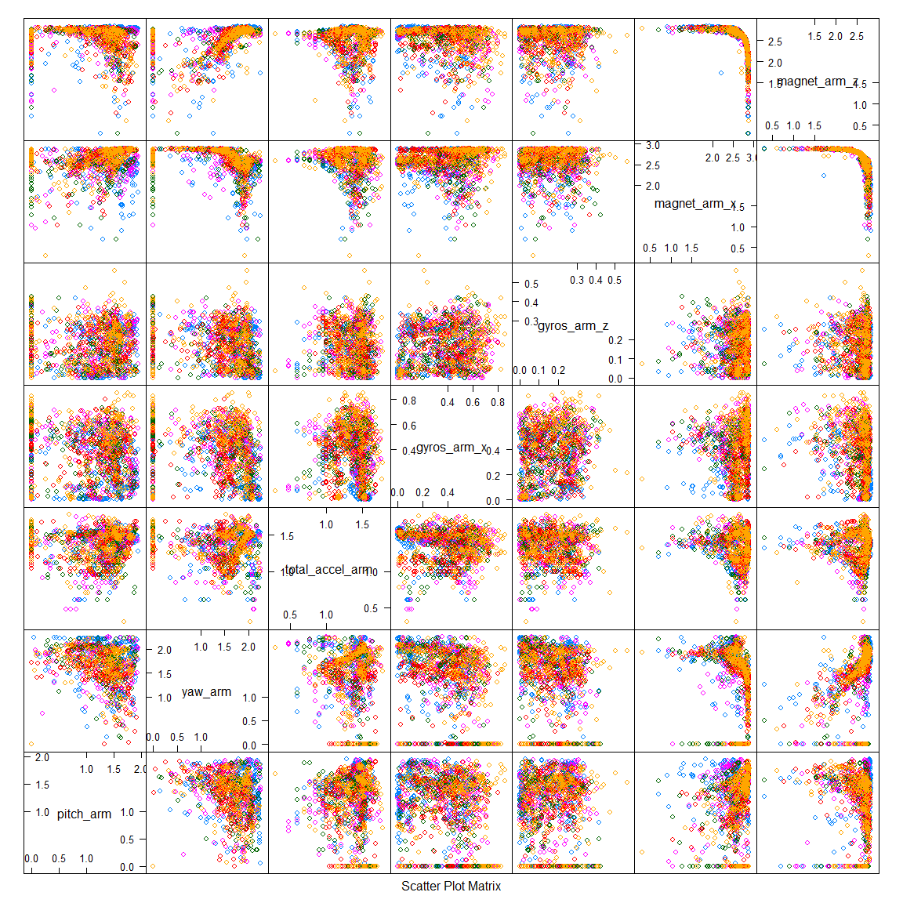
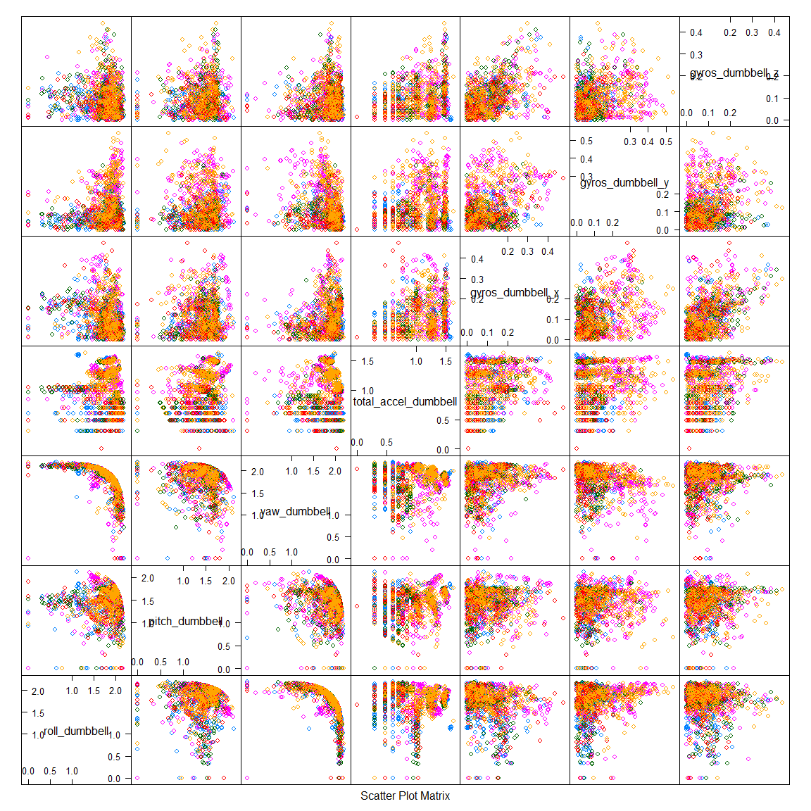
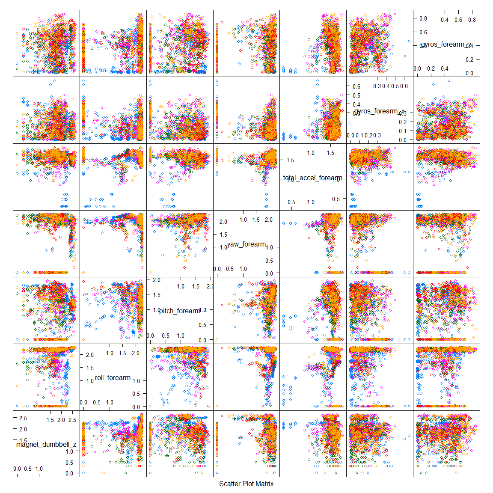
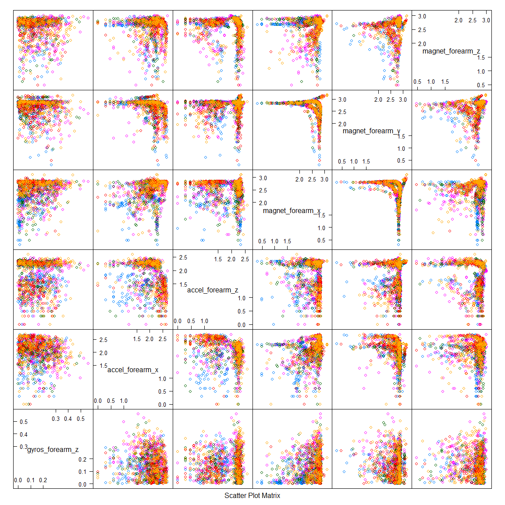

# PML Data Prediction
Sarat Konduru  
Thursday, January 22, 2015  

## Synopsis

This data analysis report is created as part of the project work done in association with the 'Practical Machine Learning' class in the Coursera's Data Science track.

The data for this project come from this source: <http://groupware.les.inf.puc-rio.br/har>.

### HAR Dataset for benchmarking

Important: you are free to use this dataset for any purpose. This dataset is licensed under the Creative Commons license (CC BY-SA). The CC BY-SA license means you can remix, tweak, and build upon this work even for commercial purposes, as long as you credit the authors of the original work and you license your new creations under the identical terms we are licensing to you. This license is often compared to "copyleft" free and open source software licenses. All new works based on this dataset will carry the same license, so any derivatives will also allow commercial use.

Read more: http://groupware.les.inf.puc-rio.br/har#ixzz3PjaRxXP4

Ugulino, W.; Cardador, D.; Vega, K.; Velloso, E.; Milidiu, R.; Fuks, H. Wearable Computing: Accelerometers' Data Classification of Body Postures and Movements. Proceedings of 21st Brazilian Symposium on Artificial Intelligence. Advances in Artificial Intelligence - SBIA 2012. In: Lecture Notes in Computer Science. , pp. 52-61. Curitiba, PR: Springer Berlin / Heidelberg, 2012. ISBN 978-3-642-34458-9. DOI: 10.1007/978-3-642-34459-6_6. 
Cited by 2 (Google Scholar)

Read more: <http://groupware.les.inf.puc-rio.br/har#ixzz3PjaB1VDY>


The goal of this data analysis is to predict the manner in which they did the exercise. This is the "classe" variable in the training set.


## Dataset

The training data for this project are available here: <https://d396qusza40orc.cloudfront.net/predmachlearn/pml-training.csv>.

The test data are available here: <https://d396qusza40orc.cloudfront.net/predmachlearn/pml-testing.csv>.

This analysis assumes both the training and testing data sets are downloaded and are placed in the project working directory. 


```
## Loading required package: caret
## Loading required package: lattice
## Loading required package: ggplot2
```


```r
#Read the training and the testing sets
train = loadDataSet("pml-training.csv")
finaltest = loadDataSet("pml-testing.csv")

# Dump the variables in the data set to get an idea of what variables we are dealing with
names(train)
```

```
##   [1] "X"                        "user_name"               
##   [3] "raw_timestamp_part_1"     "raw_timestamp_part_2"    
##   [5] "cvtd_timestamp"           "new_window"              
##   [7] "num_window"               "roll_belt"               
##   [9] "pitch_belt"               "yaw_belt"                
##  [11] "total_accel_belt"         "kurtosis_roll_belt"      
##  [13] "kurtosis_picth_belt"      "kurtosis_yaw_belt"       
##  [15] "skewness_roll_belt"       "skewness_roll_belt.1"    
##  [17] "skewness_yaw_belt"        "max_roll_belt"           
##  [19] "max_picth_belt"           "max_yaw_belt"            
##  [21] "min_roll_belt"            "min_pitch_belt"          
##  [23] "min_yaw_belt"             "amplitude_roll_belt"     
##  [25] "amplitude_pitch_belt"     "amplitude_yaw_belt"      
##  [27] "var_total_accel_belt"     "avg_roll_belt"           
##  [29] "stddev_roll_belt"         "var_roll_belt"           
##  [31] "avg_pitch_belt"           "stddev_pitch_belt"       
##  [33] "var_pitch_belt"           "avg_yaw_belt"            
##  [35] "stddev_yaw_belt"          "var_yaw_belt"            
##  [37] "gyros_belt_x"             "gyros_belt_y"            
##  [39] "gyros_belt_z"             "accel_belt_x"            
##  [41] "accel_belt_y"             "accel_belt_z"            
##  [43] "magnet_belt_x"            "magnet_belt_y"           
##  [45] "magnet_belt_z"            "roll_arm"                
##  [47] "pitch_arm"                "yaw_arm"                 
##  [49] "total_accel_arm"          "var_accel_arm"           
##  [51] "avg_roll_arm"             "stddev_roll_arm"         
##  [53] "var_roll_arm"             "avg_pitch_arm"           
##  [55] "stddev_pitch_arm"         "var_pitch_arm"           
##  [57] "avg_yaw_arm"              "stddev_yaw_arm"          
##  [59] "var_yaw_arm"              "gyros_arm_x"             
##  [61] "gyros_arm_y"              "gyros_arm_z"             
##  [63] "accel_arm_x"              "accel_arm_y"             
##  [65] "accel_arm_z"              "magnet_arm_x"            
##  [67] "magnet_arm_y"             "magnet_arm_z"            
##  [69] "kurtosis_roll_arm"        "kurtosis_picth_arm"      
##  [71] "kurtosis_yaw_arm"         "skewness_roll_arm"       
##  [73] "skewness_pitch_arm"       "skewness_yaw_arm"        
##  [75] "max_roll_arm"             "max_picth_arm"           
##  [77] "max_yaw_arm"              "min_roll_arm"            
##  [79] "min_pitch_arm"            "min_yaw_arm"             
##  [81] "amplitude_roll_arm"       "amplitude_pitch_arm"     
##  [83] "amplitude_yaw_arm"        "roll_dumbbell"           
##  [85] "pitch_dumbbell"           "yaw_dumbbell"            
##  [87] "kurtosis_roll_dumbbell"   "kurtosis_picth_dumbbell" 
##  [89] "kurtosis_yaw_dumbbell"    "skewness_roll_dumbbell"  
##  [91] "skewness_pitch_dumbbell"  "skewness_yaw_dumbbell"   
##  [93] "max_roll_dumbbell"        "max_picth_dumbbell"      
##  [95] "max_yaw_dumbbell"         "min_roll_dumbbell"       
##  [97] "min_pitch_dumbbell"       "min_yaw_dumbbell"        
##  [99] "amplitude_roll_dumbbell"  "amplitude_pitch_dumbbell"
## [101] "amplitude_yaw_dumbbell"   "total_accel_dumbbell"    
## [103] "var_accel_dumbbell"       "avg_roll_dumbbell"       
## [105] "stddev_roll_dumbbell"     "var_roll_dumbbell"       
## [107] "avg_pitch_dumbbell"       "stddev_pitch_dumbbell"   
## [109] "var_pitch_dumbbell"       "avg_yaw_dumbbell"        
## [111] "stddev_yaw_dumbbell"      "var_yaw_dumbbell"        
## [113] "gyros_dumbbell_x"         "gyros_dumbbell_y"        
## [115] "gyros_dumbbell_z"         "accel_dumbbell_x"        
## [117] "accel_dumbbell_y"         "accel_dumbbell_z"        
## [119] "magnet_dumbbell_x"        "magnet_dumbbell_y"       
## [121] "magnet_dumbbell_z"        "roll_forearm"            
## [123] "pitch_forearm"            "yaw_forearm"             
## [125] "kurtosis_roll_forearm"    "kurtosis_picth_forearm"  
## [127] "kurtosis_yaw_forearm"     "skewness_roll_forearm"   
## [129] "skewness_pitch_forearm"   "skewness_yaw_forearm"    
## [131] "max_roll_forearm"         "max_picth_forearm"       
## [133] "max_yaw_forearm"          "min_roll_forearm"        
## [135] "min_pitch_forearm"        "min_yaw_forearm"         
## [137] "amplitude_roll_forearm"   "amplitude_pitch_forearm" 
## [139] "amplitude_yaw_forearm"    "total_accel_forearm"     
## [141] "var_accel_forearm"        "avg_roll_forearm"        
## [143] "stddev_roll_forearm"      "var_roll_forearm"        
## [145] "avg_pitch_forearm"        "stddev_pitch_forearm"    
## [147] "var_pitch_forearm"        "avg_yaw_forearm"         
## [149] "stddev_yaw_forearm"       "var_yaw_forearm"         
## [151] "gyros_forearm_x"          "gyros_forearm_y"         
## [153] "gyros_forearm_z"          "accel_forearm_x"         
## [155] "accel_forearm_y"          "accel_forearm_z"         
## [157] "magnet_forearm_x"         "magnet_forearm_y"        
## [159] "magnet_forearm_z"         "classe"
```

## Preprocessing

### Basic manual pre-processing
Studying the variables in the data set, we do not need all the variables for this analysis. Some columns are aggregate columns and have mostly NA's. There are time window variables which we can get rid of, since it should not have an impact on the outcome. Also there are redundant timestamp variables. We can get rid of the timestamp variables, the username and the row index columns along with columns that have any NA's. The utility function transform performs these data cleanup.


```r
# Remove the unimportant variables from the dataset
colsToRemove <- c(1,2,3,4,5,6,7)

#  Perform prelimenary manual preProcessing  
train = transform(train, colsToRemove)
finaltest = transform(finaltest, colsToRemove)
```

### Sub-sampling for model validation
Split the training data set into two subsets for validating our data model


```r
set.seed(32415)

inTrain = createDataPartition(y=train$classe, p=0.7, list=FALSE)

subTrain = train[inTrain,]
subTest = train[-inTrain,]
```

### Check for near zero variance variables

```r
outcome = which(names(subTrain) %in% "classe")

# Find out if there exists and near Zero variance variables
noVariance = nearZeroVar(subTrain[,-outcome])

# If there are, remove them from all the data sets
if(length(noVariance) > 0){
  subTrain = subTrain[,-noVariance]
  subTest = subTest[,-noVariance]
  finaltest = finaltest[,-noVariance]
}
```

We found 0 variables having near zero variance in the data set. 

### Check if there are any more variables that have a high correlation

```r
outcome = which(names(subTrain) %in% "classe")

# Calculate the correlation matrix for the subTrain dataset
cr = cor(subTrain[,-outcome])

# Filter out variables having a high correlation
highlyCorVars <- findCorrelation(cr, cutoff = .75)

if( length(highlyCorVars) > 0 ){
  subTrain = subTrain[,-highlyCorVars]
  subTest = subTest[,-highlyCorVars]
  finaltest = finaltest[,-highlyCorVars]
}

#summary(subTrain)
```

We found 18 variables having hight correlation in the data set. 

We are now left with 34 variables left, exluding the outcome. 

### Visualizations

We shall examine the rest of the variables using pairs' plots. Since there are a lot of observations (13737), we will create a further sub-sample just for the purposes of plotting.


```r
forPlots = createDataPartition(y=subTrain$classe, p=0.1, list=FALSE)
subPlots = subTrain[forPlots,]

featurePlot(x=(log10(abs(subPlots[,c(1:7)])+1)), y=subPlots$classe, plot="pairs")
```

 

```r
featurePlot(x=(log10(abs(subPlots[,c(8:14)])+1)), y=subPlots$classe, plot="pairs")
```

 

```r
featurePlot(x=(log10(abs(subPlots[,c(15:21)])+1)), y=subPlots$classe, plot="pairs")
```

 

```r
featurePlot(x=(log10(abs(subPlots[,c(22:28)])+1)), y=subPlots$classe, plot="pairs")
```

 

```r
featurePlot(x=(log10(abs(subPlots[,c(29:34)])+1)), y=subPlots$classe, plot="pairs")
```

 

From looking at the plots, there seems to be some variables that are still correalted. 

### Principal Component Analysis

We can perform a pricipal component analysis to see if the data space can be further reduced.

```r
outcome = which(names(subTrain) %in% "classe")

PCAProc = preProcess(subTrain[,-outcome], method= c("pca"))

trainPCs = predict(PCAProc,     newdata = subTrain[,-outcome])
testPCs = predict(PCAProc,      newdata = subTest[,-outcome])
finaltestPCs = predict(PCAProc, newdata = finaltest[,-outcome])

PCAProc
```

```
## 
## Call:
## preProcess.default(x = subTrain[, -outcome], method = c("pca"))
## 
## Created from 13737 samples and 34 variables
## Pre-processing: principal component signal extraction, scaled, centered 
## 
## PCA needed 25 components to capture 95 percent of the variance
```

## Model fitting

Now that we have preprocessed the data set and reduced the variables, we can train a model using the PCAs generated above. We will fit a random forest model.

```r
fitControl = trainControl(method = "oob", number = 4, verboseIter = TRUE)
useMethod = "rf";
m = train(subTrain$classe ~ ., method=useMethod, trControl= fitControl, data=trainPCs, verbose=TRUE)
```

```
## Loading required package: randomForest
## randomForest 4.6-10
## Type rfNews() to see new features/changes/bug fixes.
```

```
## + : mtry= 2 
## - : mtry= 2 
## + : mtry=13 
## - : mtry=13 
## + : mtry=25 
## - : mtry=25 
## Aggregating results
## Selecting tuning parameters
## Fitting mtry = 2 on full training set
```

### Model error rates
The In-Sample error for the model is: 

```r
confusionMatrix(subTrain$classe, predict(m, newdata = trainPCs))
```

```
## Confusion Matrix and Statistics
## 
##           Reference
## Prediction    A    B    C    D    E
##          A 3906    0    0    0    0
##          B    0 2658    0    0    0
##          C    0    0 2396    0    0
##          D    0    0    0 2252    0
##          E    0    0    0    0 2525
## 
## Overall Statistics
##                                      
##                Accuracy : 1          
##                  95% CI : (0.9997, 1)
##     No Information Rate : 0.2843     
##     P-Value [Acc > NIR] : < 2.2e-16  
##                                      
##                   Kappa : 1          
##  Mcnemar's Test P-Value : NA         
## 
## Statistics by Class:
## 
##                      Class: A Class: B Class: C Class: D Class: E
## Sensitivity            1.0000   1.0000   1.0000   1.0000   1.0000
## Specificity            1.0000   1.0000   1.0000   1.0000   1.0000
## Pos Pred Value         1.0000   1.0000   1.0000   1.0000   1.0000
## Neg Pred Value         1.0000   1.0000   1.0000   1.0000   1.0000
## Prevalence             0.2843   0.1935   0.1744   0.1639   0.1838
## Detection Rate         0.2843   0.1935   0.1744   0.1639   0.1838
## Detection Prevalence   0.2843   0.1935   0.1744   0.1639   0.1838
## Balanced Accuracy      1.0000   1.0000   1.0000   1.0000   1.0000
```

The Out-Sample error for the model is:

```r
confusionMatrix(subTest$classe, predict(m, newdata = testPCs))
```

```
## Confusion Matrix and Statistics
## 
##           Reference
## Prediction    A    B    C    D    E
##          A 1665    5    2    1    1
##          B   28 1094   16    0    1
##          C    2   13  993   12    6
##          D    0    1   50  908    5
##          E    2    5   18    1 1056
## 
## Overall Statistics
##                                           
##                Accuracy : 0.9713          
##                  95% CI : (0.9667, 0.9754)
##     No Information Rate : 0.2884          
##     P-Value [Acc > NIR] : < 2.2e-16       
##                                           
##                   Kappa : 0.9637          
##  Mcnemar's Test P-Value : 6.556e-08       
## 
## Statistics by Class:
## 
##                      Class: A Class: B Class: C Class: D Class: E
## Sensitivity            0.9811   0.9785   0.9203   0.9848   0.9878
## Specificity            0.9979   0.9906   0.9931   0.9887   0.9946
## Pos Pred Value         0.9946   0.9605   0.9678   0.9419   0.9760
## Neg Pred Value         0.9924   0.9949   0.9823   0.9972   0.9973
## Prevalence             0.2884   0.1900   0.1833   0.1567   0.1816
## Detection Rate         0.2829   0.1859   0.1687   0.1543   0.1794
## Detection Prevalence   0.2845   0.1935   0.1743   0.1638   0.1839
## Balanced Accuracy      0.9895   0.9845   0.9567   0.9868   0.9912
```

## Prediction
Now finally using the model, predict the final 20 test set and write into the text files that are to be submitted.

```r
answers = as.character(predict(m, newdata = finaltestPCs))

pml_write_files(answers, useMethod)
```

## Summary
The generated files were submitted to the coursera website.
